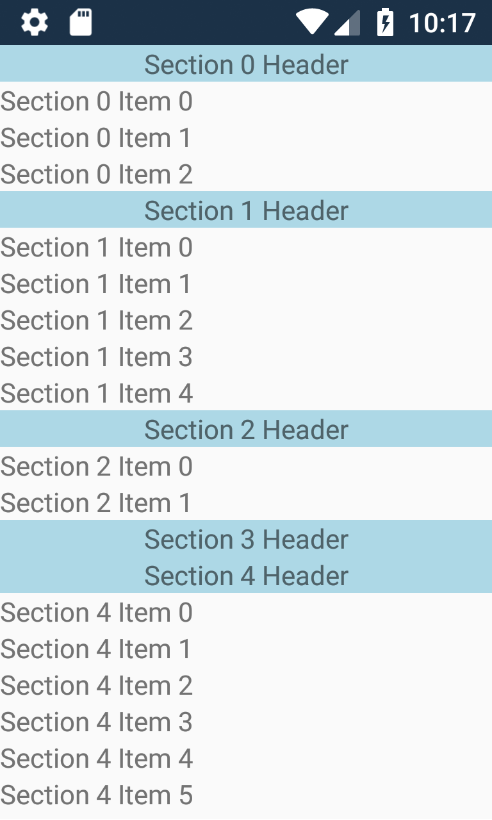

# SectionedRecyclerViewAdapter

This is an abstract recycler view adapter that helps you create sectioned table views on Xamarin.iOS.



Someone else had already written one [here](https://github.com/sadedil/SectionedRecyclerViewAdapter). Mine makes it easier to insert/remove/move rows.

## Usage

Add SectionedRecyclerViewAdapter.cs to your project and subclass SectionedRecyclerViewAdapter. Then use it normally.

An example project is included in the Git repo. Here is the child class used to make the above image:

```cs
using Android.Graphics;
using Android.Support.V7.Widget;
using Android.Views;
using Android.Widget;
using Controls;
using System.Collections.Generic;

namespace App1
{
    public class RecyclerViewAdapter : SectionedRecyclerViewAdapter
    {
        #region Nested classes

        private class ViewHolder : RecyclerView.ViewHolder
        {
            public ViewHolder(View textView) : base(textView)
            {
                this.TextView = (TextView)textView;
            }

            public TextView TextView { get; }

            public int Section { get; set; }
        }

        #endregion

        #region Fields

        private static readonly IDictionary<int, int> ItemCountForSection = new Dictionary<int, int>
        {
            { 0, 3 },
            { 1, 5 },
            { 2, 2 },
            { 3, 0 },
            { 4, 7 },
        };

        #endregion

        #region Properties

        protected override int SectionCount => RecyclerViewAdapter.ItemCountForSection.Count;

        #endregion

        #region Methods

        protected override void BindItemViewHolder(RecyclerView.ViewHolder holder, int section, int item)
        {
            var viewHolder = holder as ViewHolder;
            viewHolder.TextView.Text = $"Section {section} Item {item}";
            viewHolder.Section = section;
        }

        protected override void BindSectionHeaderViewHolder(RecyclerView.ViewHolder holder, int section)
        {
            (holder as ViewHolder).TextView.Text = $"Section {section} Header";
        }

        protected override RecyclerView.ViewHolder CreateItemViewHolder(ViewGroup parent)
        {
            var itemTextView = RecyclerViewAdapter.CreateTextView(parent);
            var viewHolder = new ViewHolder(itemTextView);

            itemTextView.Click += (sender, e) =>
            {
                this.AddNewRow(viewHolder.Section);
            };

            return viewHolder;
        }

        protected override RecyclerView.ViewHolder CreateSectionHeaderViewHolder(ViewGroup parent)
        {
            var sectionHeaderTextView = RecyclerViewAdapter.CreateTextView(parent);
            sectionHeaderTextView.SetBackgroundColor(Color.LightBlue);
            sectionHeaderTextView.TextAlignment = TextAlignment.Center;

            return new ViewHolder(sectionHeaderTextView);
        }

        protected override int GetItemCountForSection(int section)
        {
            return RecyclerViewAdapter.ItemCountForSection[section];
        }

        private static TextView CreateTextView(ViewGroup parent)
        {
            var textView = new TextView(parent.Context);
            textView.LayoutParameters = new ViewGroup.LayoutParams(
                ViewGroup.LayoutParams.MatchParent,
                ViewGroup.LayoutParams.WrapContent
            );

            return textView;
        }

        private void AddNewRow(int section)
        {
            var currentItemCount = RecyclerViewAdapter.ItemCountForSection[section];
            var newItemCount = currentItemCount + 1;
            RecyclerViewAdapter.ItemCountForSection[section] = newItemCount;
            this.NotifyItemInserted(section, newItemCount - 1);
        }

        #endregion
    }
}
```

It also adds new rows when you tap in a section.

## Adding, moving, and removing rows

You can call the new overloads for `NotifyItemInserted(int section, int item)`, `NotifyItemChanged(int section, int item)`, `NotifyItemMoved(int section, int item)` and `NotifyItemRemoved(int section, int item)`. The example project demonstrates adding rows.

### Can I add/remove ranges or whole sections?

It's not built in, because I haven't needed to do this, but you should be able to get it to work.

You can call `getPosition(int section, int item)` on the adapter to get the internal position of an element. Then you can call the relevant normal RecyclerView.Adapter methods. To get the internal position of a section header, you can do `getPosition(sectionIndex, 0) - 1`.
